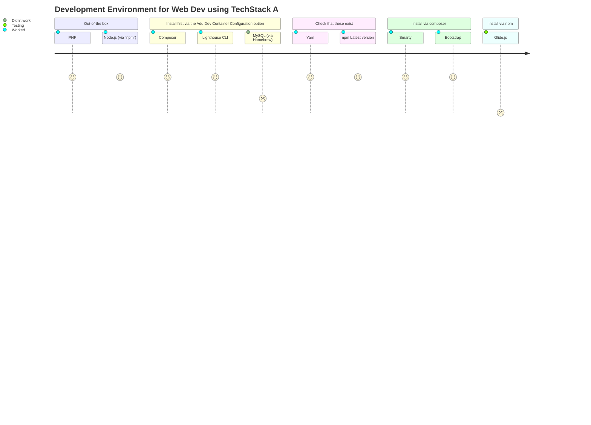

# DevEnv-Smarty

A GitHub Codespaces **Dev**eloper **Env**ironment as a service (DEaaS), replicating the environment that you were given at the Introduction to Web Development module.

## Overview of the process[^1]
[^1]: *Note*: This diagramme will only preview on Github (ie via https://github.com/kakiac/DevEnv-Smarty). It was generated using Mermaid https://mermaid.js.org/intro/). Check out this blog https://www.drawio.com/blog/mermaid-diagrams for some templates.

Development Environment for Web Dev using TechStack A

## How it was created

### Step 1

A blank codespace was created from a blank repository. The following are installed by default:

  -  PHP
  -  Node.js (via nvm), yarn and pnpm

There are other things installed by default, see the full list here: https://aka.ms/ghcs-default-image 

### Step 2
the following plugins were installed to the devcontainer.json via bottom left "Codespaces" button, then "Add Dev Container Configuration files" > "Modify your current configuration" then searching for the following packages and ensuring the boc on the left is ticked:

  - Composer (via Github Releases) - from devcontainers-contrib
  - Lighthouse CLI (via npm) - from devcontainers-contrib

I also tried installying this, but threw errors:

  - MySQL (via Homebrew)

### Step 3
Click on rebuild once it pops up. Your codespace will be recreated and install these packages. This will take some time, but you can click on the "View Log" link to view what is happening in the background.

### Step 4
Your codespace should restart.

All commands in `this font` to be run in the **terminal**.

### Step 5
Run 

`composer -v` 

to check that you are running composer and that it was successfully installed. You should be getting the composer logo and some usage commands.

### Step 6
If so, run the following command to install **Smarty**

`composer require smarty/smarty`

This should install Smarty. Smarty is a template engine for PHP, facilitating the separation of presentation (HTML/CSS) from application logic. You can find more information about it here: https://packagist.org/packages/smarty/smarty 

You should now see some additional files added (vendor folder, composer.json, composer.lock)

Commit and push your changes to the repository.

### Step 7
Check that Yarn is installed

`yarn -version`

### Step 8
Update **npm**

`npm install -g npm@10.4.0`

### Step 9
Install **Bootstrap**

`composer require twbs/bootstrap:5.3.3`

This should succeed with some package being reported as being installed.

https://getbootstrap.com/docs/5.3/getting-started/introduction/ includes more information about bootstrap

See it working:

Create an http-server to preview the index.html:

`npm i -g http-server`

Next, run the server

`http-server`

A pop up will show, with information about your application running on local port 8080. Click on the green button "Show in the browser". If you miss this, you can click on "ports" tab next to the terminal tab, find the 8080 port and click on the browser icon.

You should now see the webpage previewed.

Alternatively, you can install a plugin that previews the webpage from within Codespaces, see here for more info: https://stackoverflow.com/questions/74452866/how-preview-a-html-file-github-codespaces 

You should now be able to preview some elements of the nav bar

### Step 10
Install **Glide.js** to create a cool slider at the top of the website.

`npm install @glidejs/glide`

Or add it using yarn

And follow the installation details (changing your css/html/scss) in this link https://yarnpkg.com/package?q=%40glidejs%2Fglide&name=%40glidejs%2Fglide 

**Note**: if the server is running, you might need to interrupt it pressing Ctrl+C

